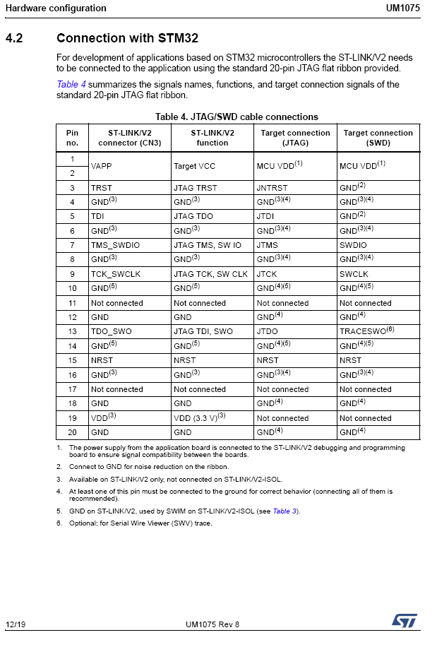

# ABOUT  
This is simple adapter board to use STM SWD interface from STLink programmer. Mind that distance form external goldpin header row to programmer edge measures 8 mm for V2 version - check with your programmer before PCB run.

# Reference

Connections table is avaliable in [ST UM1075](https://www.st.com/content/ccc/resource/technical/document/user_manual/65/e0/44/72/9e/34/41/8d/DM00026748.pdf/files/DM00026748.pdf/jcr:content/translations/en.DM00026748.pdf) on page 12:  




